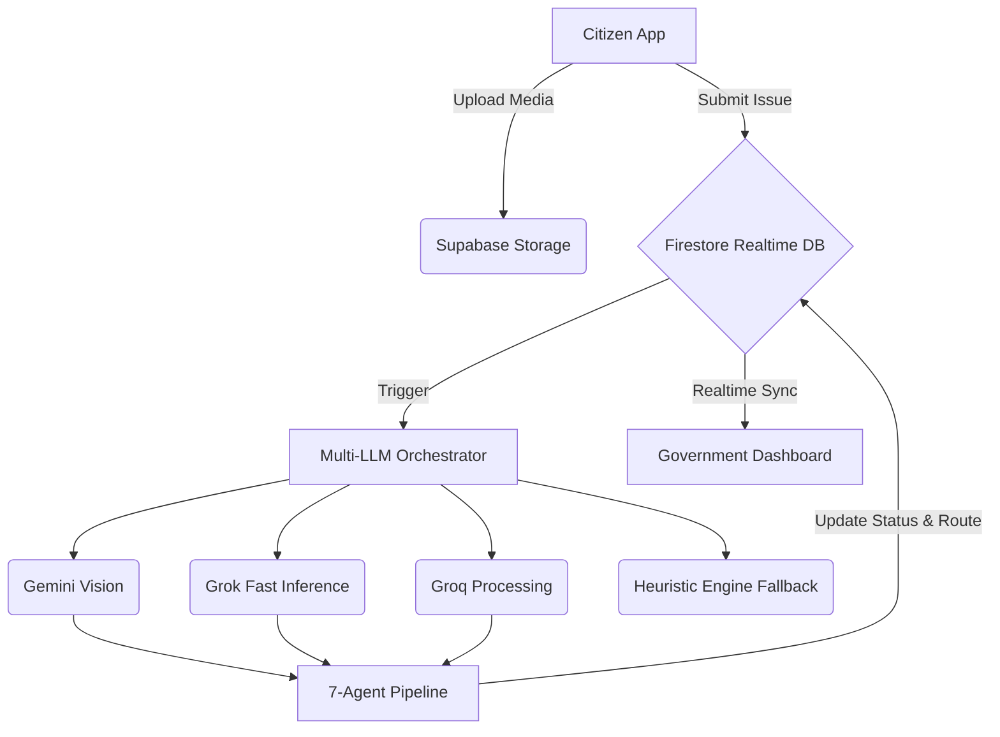

# CivicMind AI

**The AI Operating System for Smart Cities**


## Project Overview:
CivicMind AI bridges the critical gap between citizens and local government by providing real-time intelligence, automated issue classification, predictive infrastructure analysis, and community-driven verification. It empowers citizens to report civic issues seamlessly while equipping government administrators with AI-driven triage, routing, and resolution tools.

## Problem Statement
Modern urban governance faces a massive backlog of civic issues (potholes, water leaks, infrastructure damage). Traditional reporting systems are slow, manual, lack transparency, and struggle to accurately categorize and route issues to the correct municipal departments.

## Solution Overview
CivicMind AI transforms civic action using a **Multi-LLM Orchestrator** and a **7-Agent Intelligence Pipeline**. Citizens upload images or videos of issues. The AI automatically classifies the severity, detects duplicates, assigns the correct department, and predicts future infrastructure failures. A decentralized "Community Verification" system builds trust, rewarding active citizens with Civic Reputation points.

---

## Key Features
- **7-Agent Intelligence Pipeline**: An autonomous multi-agent system handling vision inspection, severity assessment, category assignment, and resolution pathways.
- **Multi-LLM Orchestrator**: Seamlessly routes AI tasks between Gemini, Grok, Groq, and a local Heuristic Fallback for maximum resiliency and speed.
- **Geo-Intelligence & Live Maps**: Real-time Leaflet map integration for hotspot tracking and geographic clustering.
- **Predictive Infrastructure**: AI forecasts maintenance needs based on historical data patterns.
- **Civic Reputation Engine**: Citizens earn dynamic scores (+25 for reporting, +50 for resolution) stored securely in their profiles.
- **Real-Time Dashboards**: Separate, tailored UI portals for Citizens (Reporters) and Government Officials (Admins).
- **Supabase High-Speed Media**: Secure, fast image and video uploads directly bypassing Firebase limits.

---

## Architecture Diagram



---

## Seven-Agent AI Pipeline
Our proprietary pipeline processes every submitted issue through seven specialized AI agents:
1. **Vision Inspector**: Analyzes citizen photos/videos for hazards and infrastructure defects.
2. **Issue Classification**: Categorizes the issue (e.g., Water, Roads, Waste).
3. **Geo Intelligence**: Maps the location, assigns wards, and detects spatial hotspots.
4. **Duplicate Detection**: Cross-references active database issues to prevent spam.
5. **Community Verification**: Calculates trust scores based on citizen reputation.
6. **Department Assignment**: Routes the issue to the precise government department.
7. **Resolution Recommendation**: Suggests repair strategies to municipal engineers.

---

## Technology Stack
- **Frontend**: Vanilla JavaScript (ES6+), HTML5, CSS3, Vite
- **UI/UX**: Google Stitch Premium Design System (Glassmorphism, Dark Theme)
- **Authentication**: Firebase Authentication
- **Database**: Firebase Cloud Firestore (NoSQL, Realtime Sync)
- **Storage**: Supabase Storage (Blob Media Storage)
- **Mapping**: Leaflet.js / OpenStreetMap
- **AI Models**: Google Gemini API, xAI Grok API, Groq Cloud API

---

## Installation & Local Development Setup

### 1. Clone the repository
```bash
git clone https://github.com/yourusername/civicmind-ai.git
cd civicmind-ai
```

### 2. Install dependencies
```bash
npm install
```

### 3. Environment Variables
Create a `.env` file in the root directory based on `.env.example`:
```env
VITE_FIREBASE_API_KEY=YOUR_FIREBASE_API_KEY
VITE_FIREBASE_AUTH_DOMAIN=YOUR_FIREBASE_AUTH_DOMAIN
VITE_FIREBASE_PROJECT_ID=YOUR_FIREBASE_PROJECT_ID
VITE_SUPABASE_URL=YOUR_SUPABASE_URL
VITE_SUPABASE_ANON_KEY=YOUR_SUPABASE_ANON_KEY
VITE_GEMINI_API_KEY=YOUR_GEMINI_API_KEY
VITE_GROK_API_KEY=YOUR_XAI_API_KEY
VITE_GROQ_API_KEY=YOUR_GROQ_API_KEY
VITE_DEFAULT_AI_PROVIDER=auto
```

### 4. Run the Development Server
```bash
npm run dev
```
Navigate to `http://localhost:5173`.

---

## Deployment Instructions

To build the project for production:
```bash
npm run build
```
The optimized production files will be generated in the `dist/` directory. Deploy this directory to Firebase Hosting, Vercel, Netlify, or any static hosting provider.

---

## Project Folder Structure
```text
civicmind-ai/
+-- public/                 # Static assets
+-- src/
¦   +-- services/
¦   ¦   +-- agents/         # 7-Agent Pipeline & Multi-LLM Orchestrator
¦   ¦   +-- auth.js         # Firebase Auth integration
¦   ¦   +-- issues.js       # Firestore CRUD & Rules
¦   ¦   +-- storage.js      # Supabase Uploads
¦   ¦   +-- mapController.js# Leaflet map logic
¦   +-- main.js             # Core Application, Router, & UI Rendering
¦   +-- style.css           # Premium Google Stitch styling
+-- index.html              # Entry point
+-- package.json            # Dependencies & Scripts
+-- firestore.rules         # Security Rules
+-- README.md               # Project Documentation
```

---

## Demo Credentials

Judges and reviewers can immediately access the platform using the pre-configured accounts below:

### Government / Admin (City Official Portal)
- **Email**: `shaik@12test.com`
- **Password**: `123456`

### Citizen (Public Portal)
*You may register a brand new account from the login screen, or use the demo account below:*
- **Email**: `testcitizen999@example.com`
- **Password**: `123456`

---

## 5-Minute Demo Guide
1. **Report an Issue**: Go to the login screen and register a new Citizen account (or use the demo).
2. **Submit Media**: Navigate to *Report an Issue*. Upload an image of a pothole or broken streetlight.
3. **AI Categorization**: Watch the UI update in real-time as the 7-Agent Pipeline processes the image, assigns a severity level, and routes it to a department.
4. **Admin Review**: Log out and log back in using the **Government Admin** credentials (`shaik@12test.com`).
5. **City Intelligence**: Navigate to the *City Intelligence* dashboard to view global heatmaps and metrics.
6. **Resolve Issue**: Open the issue you just created and change its status to **Resolved**.
7. **Citizen Reward**: Log back in as the Citizen and verify that the issue is closed and your **Civic Reputation Score** has automatically increased.

---

## Screenshots:-

*(Placeholders for GitHub Repository)*

| Citizen Dashboard | Government Command Center |
| :---: | :---: |
|  |  |

| AI Copilot | Real-time Maps |
| :---: | :---: |
|  |  |

---

## Future Enhancements
- **IoT Integration**: Directly sync sensor data (water pressure, traffic cameras) into the CivicMind pipeline.
- **Blockchain Verification**: Store high-priority community trust scores immutably.
- **Mobile Native Apps**: React Native wrappers for iOS/Android with offline-first support.
- **Automated Contractor Bidding**: AI automatically drafts work orders based on the Vision Agent's analysis.

---

## License
This project is licensed under the MIT License. 
