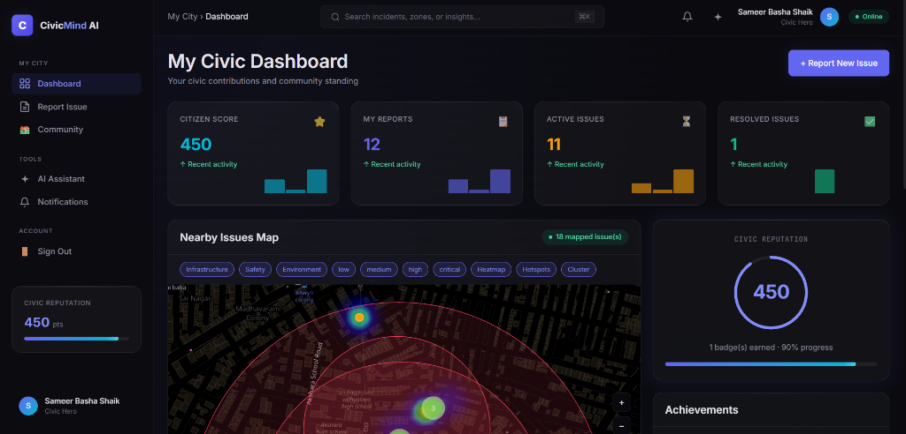
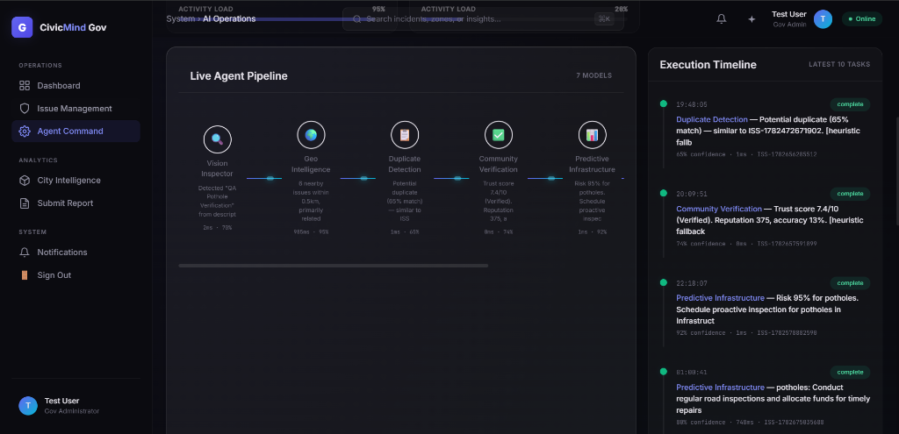
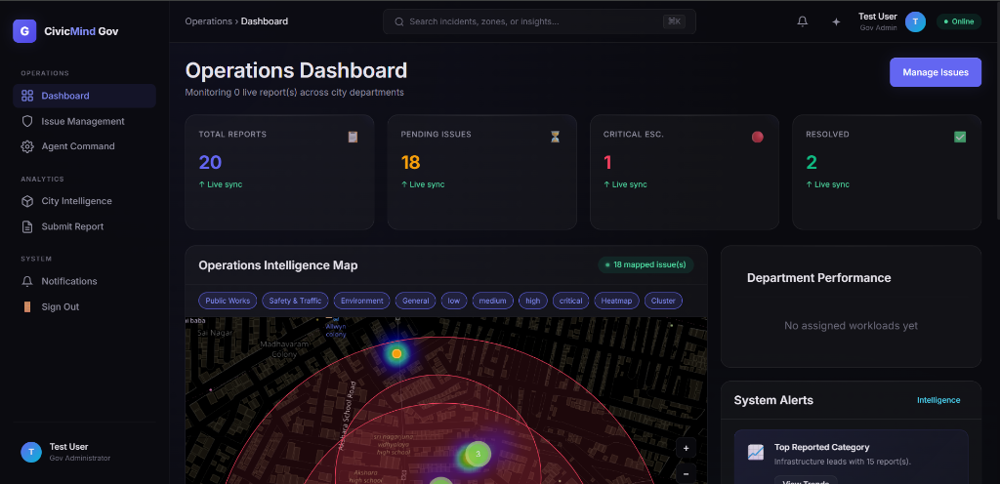
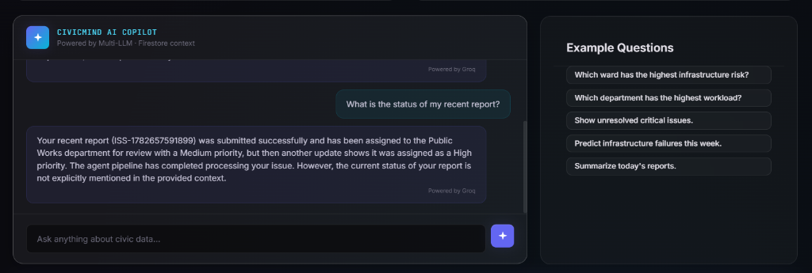
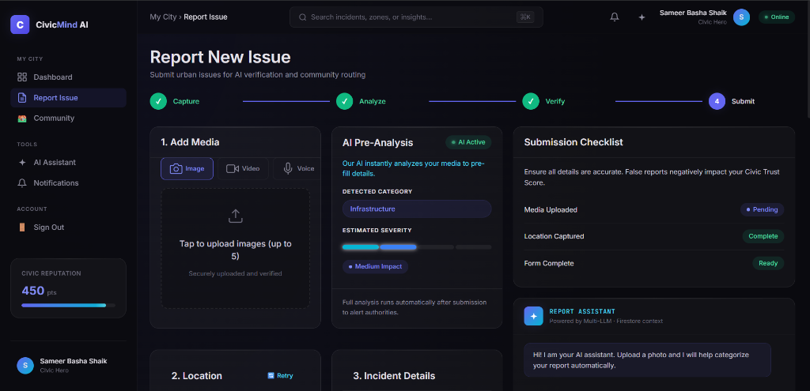

# 🚀 CivicMind AI
### Multi-Agent AI Powered Hyperlocal Community Problem Solver
**Empowering Communities through Artificial Intelligence, Collaboration, and Real-Time Civic Intelligence**

---

**Project Logo:** (Included in GitHub Repo)
**Hackathon Name:** Google AI Hackathon
**Problem Statement Selected:** Community Hero – Hyperlocal Problem Solver
**Developer:** Shaik Sameer
**Date:** June 2026

---

## Table of Contents
1. [Problem Statement Selected](#1-problem-statement-selected)
2. [Solution Overview](#2-solution-overview)
3. [Key Features](#3-key-features)
4. [AI Agent Architecture](#4-ai-agent-architecture)
5. [Technologies Used](#5-technologies-used)
6. [Google Technologies Utilized](#6-google-technologies-utilized)
7. [System Architecture](#7-system-architecture)
8. [User Journey](#8-user-journey)
9. [Innovation](#9-innovation)
10. [Technical Challenges](#10-technical-challenges)
11. [Security](#11-security)
12. [Scalability](#12-scalability)
13. [Future Scope](#13-future-scope)
14. [Impact](#14-impact)
15. [Why CivicMind AI Should Win](#15-why-civicmind-ai-should-win)

---

## 1. Problem Statement Selected

### Community Hero – Hyperlocal Problem Solver

Urban centers worldwide are facing a significant crisis in maintaining public infrastructure. Potholes destroy vehicles, uncollected garbage poses extreme health hazards, broken streetlights invite crime, water leakages waste millions of gallons of fresh water, and illegal dumping sites contaminate residential areas. 

Despite the urgency of these hyper-local issues, existing complaint systems and municipal hotlines consistently fail due to:
- **Lack of Transparency**: Citizens submit complaints into a "black box" and never receive updates.
- **Duplicate Complaints**: Dozens of citizens report the exact same pothole, clogging the municipal pipeline.
- **Poor Communication**: Departments operate in silos without cross-communication.
- **No Citizen Participation**: Citizens are treated as complainers rather than collaborative problem-solvers.
- **Slow Verification**: Municipalities waste thousands of man-hours dispatching inspectors to verify if a reported pothole actually exists.
- **No Intelligent Prioritization**: A critical chemical spill is often queued behind a minor sidewalk crack simply because it was reported later.
- **No Predictive Analytics**: Cities react to infrastructure failure rather than preventing it.

The relationship between citizens and local authorities is fractured. We need a system that restores trust, gamifies civic duty, and uses artificial intelligence to instantly triage, verify, and route issues without human bottlenecks.

---

## 2. Solution Overview

**CivicMind AI** is an intelligent, multi-agent civic intelligence platform. Instead of a traditional CRUD (Create, Read, Update, Delete) application, CivicMind acts as a living digital nervous system for the city.

The platform orchestrates a pipeline of specialized AI agents powered by **Google Gemini** and **Groq (Llama-3.3)** to automatically analyze incoming reports, extract metadata, verify claims against community consensus, predict infrastructure decay, and route issues to the correct government department instantly.

### The Complete Workflow
1. **Citizen Submission**: A citizen captures an image of an issue (e.g., a pothole) and uploads it via the Citizen Portal.
2. **AI Vision Analysis**: The *Vision Inspector* agent analyzes the image, automatically categorizing the issue, extracting context, and determining initial severity.
3. **Geo Intelligence**: The *Geo Intelligence* agent maps the coordinates, identifies the specific ward, and pulls historical data for that exact location.
4. **Duplicate Detection**: The *Duplicate Detection* agent queries the active database to ensure this isn't the 50th report of the same pothole, merging it if necessary.
5. **Community Verification**: The *Verification* agent cross-references the citizen's reputation score to assign a confidence metric to the report.
6. **Priority Analysis**: The *Predictive Infrastructure* agent analyzes the context and elevates the priority if the issue poses an immediate systemic threat.
7. **Department Assignment**: The *Resolution* agent routes the issue to the precise municipal department (e.g., Public Works vs. Waste Management).
8. **Admin Dashboard**: City officials see the fully verified, categorized, and prioritized issue instantly on their Operations Dashboard.
9. **Resolution Tracking**: As the city resolves the issue, status updates propagate in real-time via Firestore.
10. **Analytics**: The data is aggregated into city-wide intelligence heatmaps.
11. **Citizen Notification**: The *Notification* agent drafts a contextual, empathetic message to the citizen, awarding them reputation points.

---

## 3. Key Features

| Feature | Description |
| :--- | :--- |
| **🤖 AI Image Analysis** | Automatically categorizes and assesses severity from uploaded photos. |
| **📍 Geo-tagging** | Captures precise GPS coordinates and reverse-geocodes neighborhoods. |
| **🗺️ Interactive Maps** | Real-time heatmaps and clustering using Leaflet to identify hotspots. |
| **⏱️ Real-time Tracking** | Live Firestore synchronization ensures citizens see updates instantly. |
| **✅ Community Verification** | Algorithmic trust scoring based on historical user accuracy. |
| **📋 Duplicate Detection** | AI semantic matching prevents municipal pipeline clogging. |
| **📊 Predictive Analysis** | Flags minor issues that indicate impending systemic failures. |
| **📈 Impact Dashboard** | Government view for monitoring department workloads and critical escalations. |
| **🏅 Citizen Reputation** | Gamified points system rewarding accurate and helpful reporting. |
| **✨ AI Copilot** | Natural language chat interface for querying the live civic database. |
| **🔐 Role Based Auth** | Secure separation between Citizen portals and Government Administration. |
| **📦 Media Upload** | Secure, scalable video and image persistence via Supabase. |

<br/>
<div align="center">
  
  <p><em>Figure 1: Citizen Dashboard showing gamified reputation and local hotspots.</em></p>
</div>

---

## 4. AI Agent Architecture

CivicMind AI utilizes a state-of-the-art **Multi-Agent Architecture**. Rather than relying on a single massive prompt, the system deploys atomic, specialized agents that pass context sequentially.

### 🔍 Vision Inspector
- **Purpose**: To act as the digital eyes of the municipality.
- **Inputs**: Raw image/video from the citizen and a brief description.
- **Processing**: Utilizes Gemini 1.5 Pro to perform zero-shot classification, identify hazards, and read text in the image (e.g., street signs).
- **Outputs**: Standardized JSON containing category, severity, and visual evidence summary.
- **Real-world benefit**: Eliminates the need for a human dispatcher to manually categorize thousands of daily reports.

### 🌍 Geo Intelligence
- **Purpose**: To provide spatial context.
- **Inputs**: Raw GPS coordinates.
- **Processing**: Evaluates proximity to critical infrastructure (schools, hospitals, power grids).
- **Outputs**: Enriched location context and ward assignment.
- **Real-world benefit**: Automatically escalates a broken streetlight if it is located next to a primary school.

### 📋 Duplicate Detection
- **Purpose**: To deduplicate the reporting pipeline.
- **Inputs**: The new report's visual signature, description, and coordinates.
- **Processing**: Compares against all active reports within a 500m radius using fuzzy matching.
- **Outputs**: A similarity percentage and an exact match flag.
- **Real-world benefit**: Prevents 100 people from dispatching 100 different crews to the same fallen tree.

### ✅ Community Verification
- **Purpose**: To establish trust without requiring physical municipal inspection.
- **Inputs**: Citizen reputation score, historical accuracy, and duplicate corroborations.
- **Processing**: Calculates a dynamic Trust Score.
- **Outputs**: Verification boolean (Trusted vs. Pending Review).
- **Real-world benefit**: Allows municipalities to confidently dispatch crews to "Trusted" issues without sending an inspector first, saving thousands of hours.

### 📊 Predictive Infrastructure
- **Purpose**: To shift from reactive to proactive maintenance.
- **Inputs**: Category, severity, and location.
- **Processing**: Analyzes if the issue (e.g., minor water pooling) is a symptom of a larger impending failure (e.g., a burst main line).
- **Outputs**: Risk percentage and proactive recommendations.
- **Real-world benefit**: Saves millions in emergency repair costs by catching systemic failures early.

### 💡 Resolution Recommendation
- **Purpose**: To automate bureaucratic routing.
- **Inputs**: All previously generated context.
- **Processing**: Maps the issue to exact municipal departments and suggests the required equipment (e.g., "Requires asphalt and a 3-man crew").
- **Outputs**: Assigned Department and Mitigation Strategy.
- **Real-world benefit**: Ensures the right crew with the right tools arrives on the first visit.

### 🔔 Notification Agent
- **Purpose**: To maintain empathetic citizen communication.
- **Inputs**: Issue status changes and resolution notes.
- **Processing**: Drafts personalized, context-aware notifications.
- **Outputs**: Human-readable status updates.
- **Real-world benefit**: Restores trust by ensuring citizens feel heard and valued.

### ✨ AI Copilot
- **Purpose**: To provide an interactive query layer over the entire database.
- **Inputs**: Natural language questions from admins or citizens (e.g., "Which ward has the most unresolved potholes?").
- **Processing**: RAG (Retrieval-Augmented Generation) against live Firestore data.
- **Outputs**: Instant answers, data summaries, and predictions.
- **Real-world benefit**: Democratizes data access without requiring SQL knowledge.

<br/>
<div align="center">
  
  <p><em>Figure 2: The Live Agent Pipeline executing in real-time.</em></p>
</div>

---

## 5. Technologies Used

| Layer | Technology |
| :--- | :--- |
| **Frontend Framework** | Vite, Vanilla JavaScript, HTML5, CSS3 |
| **Database** | Firebase Cloud Firestore (NoSQL, Real-time) |
| **Authentication** | Firebase Auth (Google & Email/Password) |
| **Media Storage** | Supabase Storage (S3-compatible) |
| **Mapping Engine** | Leaflet.js, OpenStreetMap |
| **Primary AI Orchestrator** | Google Gemini (Gemini 1.5 Pro / Flash) |
| **Secondary AI Fallback** | Groq (Llama-3.3-70b-versatile) |
| **Containerization** | Docker |
| **CI/CD Pipeline** | Google Cloud Build |
| **Hosting & Compute** | Google Cloud Run (Serverless) |

---

## 6. Google Technologies Utilized

CivicMind AI is deeply integrated into the Google Cloud and AI ecosystem, heavily leveraging Google's infrastructure for scale, speed, and intelligence.

- **Google Gemini API**: Serves as the core intelligence engine for the Vision Inspector. Gemini's multimodal capabilities are uniquely suited to analyze both the raw imagery of a pothole and the text description simultaneously, returning highly structured JSON that drives the rest of the pipeline.
- **Firebase Authentication**: Provides secure, frictionless onboarding. We utilize Google Sign-In to lower the barrier to entry for citizens, ensuring rapid adoption.
- **Cloud Firestore**: Acts as the real-time nervous system. When a citizen submits a report, Firestore's websocket connections instantly push the update to the Admin Dashboard without requiring a page refresh.
- **Google Cloud Run**: The entire application is containerized and deployed to Cloud Run. This serverless architecture ensures that the platform scales to zero during the night to save costs, but can instantly scale to handle thousands of concurrent users during a major civic event (e.g., a storm causing widespread damage).
- **Google Cloud Build**: Automated CI/CD. Every push to the GitHub `main` branch triggers a secure build process that compiles the Vite frontend, injects environment variables securely, builds the Docker container, and deploys it to Cloud Run with zero downtime.

---

## 7. System Architecture

CivicMind AI utilizes a decentralized, event-driven architecture designed for high availability and rapid processing.

1. **Client Layer**: Citizens access the responsive web app. They capture media and geolocation data.
2. **Persistence Layer**: Images/videos are securely uploaded to Supabase Storage. The structural metadata (coordinates, description) is saved to Firestore.
3. **Multi-LLM Orchestrator**: The application dynamically routes inference tasks between Gemini 1.5 Pro and Groq based on quota limits, token performance, and vision requirements.
4. **Execution Pipeline**: The 7 agents execute sequentially, updating the Firestore document at each step.
5. **Real-time Sync**: The Admin dashboard listens to Firestore and updates live.

<br/>
<div align="center">
  
  <p><em>Figure 3: CivicMind AI Event-Driven Architecture.</em></p>
</div>

---

## 8. User Journey

### The Citizen Journey
1. **Discover**: Citizen encounters an overflowing public garbage bin.
2. **Report**: Opens CivicMind on their phone, snaps a photo, and hits submit. The GPS is captured automatically.
3. **Instant Feedback**: The AI instantly categorizes the issue as "Waste Management" and marks the severity as "Medium".
4. **Track**: The citizen views their dashboard, seeing the issue move from "Open" to "In Progress".
5. **Reward**: Upon resolution, the citizen receives a push notification and 50 "Civic Reputation" points, unlocking the "Eco Champion" badge.

### The Admin Journey
1. **Monitor**: The City Manager opens the Operations Dashboard.
2. **Alert**: A critical alert flashes: a burst water pipe has been verified by the AI with 95% confidence based on 3 duplicate reports.
3. **Analyze**: The Admin opens the issue, views the AI's predictive risk assessment (warning of potential sinkhole formation), and the AI's recommendation to dispatch a heavy-duty crew.
4. **Action**: The Admin clicks "Assign to Public Works".
5. **Resolve**: Once the crew finishes, the Admin marks it resolved. The AI automatically drafts the resolution summary for the citizens.

<br/>
<div align="center">
  
  <p><em>Figure 4: Government Operations Dashboard showing active issues and workload distribution.</em></p>
</div>

---

## 9. Innovation

What sets CivicMind AI apart from standard reporting tools?

- **Multi-Agent Orchestration**: We don't just use AI to summarize text. We use specialized, chained AI agents that mimic a human bureaucracy—without the delays.
- **Hybrid Gemini + Groq Architecture**: By dynamically switching between Google Gemini (for unparalleled multimodal vision) and Groq (for lightning-fast language inference), we achieve maximum performance and avoid quota bottlenecks.
- **Predictive Infrastructure**: Instead of just logging a "water puddle", the AI cross-references weather and location to warn the city of an impending pipe burst.
- **Community Trust Score**: Gamifying civic duty mathematically verifiable trust. If a user consistently reports fake issues, their trust score drops, and their future reports are deprioritized.
- **Real-Time Collaboration**: Through Firestore, the gap between the citizen taking a photo and the mayor seeing the statistic is reduced to milliseconds.

---

## 10. Technical Challenges

Building a production-ready, AI-driven platform in a hackathon timeframe presented immense challenges:

- **AI Formatting Hallucinations**: LLMs often return markdown fences (```json) even when instructed not to. *Solution*: Built a robust regex-based JSON parser and validation schema to guarantee the frontend never crashes on bad AI output.
- **API Quota Limits**: Free-tier APIs rate-limit heavily during multi-agent pipeline executions. *Solution*: Implemented an intelligent fallback orchestrator. If Gemini hits a 429 Quota Error, the system instantly switches the workload to Groq transparently.
- **Vite Environment Variables in Docker**: Standard Vite apps expect variables at build time, causing our Cloud Run deployments to lose API keys. *Solution*: Overhauled the `cloudbuild.yaml` to pass variables securely via Docker `--build-arg` and refined the Vite configuration.
- **Complex State Management**: Tracking the exact execution state of 7 different AI agents in real-time on the UI. *Solution*: Leveraged Firestore's `onSnapshot` listeners to stream granular agent logs directly to the DOM.

<br/>
<div align="center">
  
  <p><em>Figure 5: CivicMind AI Copilot allowing natural language database queries.</em></p>
</div>

---

## 11. Security

- **Authentication**: All users must authenticate via Firebase Auth.
- **Role-Based Access Control (RBAC)**: Firestore Rules explicitly prevent citizens from accessing the `/admin` routes or modifying issue statuses.
- **Storage Rules**: Supabase buckets are configured to only allow uploads from authenticated sessions, preventing malicious file dumping.
- **Environment Isolation**: API keys are injected at build-time in Cloud Build and are never exposed in the source code repository.

---

## 12. Scalability

CivicMind AI is designed to scale from a single neighborhood to a massive metropolis seamlessly.
- **Stateless Cloud Run**: The frontend is entirely stateless. Google Cloud Run will automatically scale the containers to handle 1 user or 1,000,000 users without manual intervention.
- **NoSQL Firestore**: Firestore handles millions of concurrent connections, ensuring that even during a major natural disaster (when reports spike), the database will not lock up.
- **Edge Media Delivery**: Supabase Storage utilizes global CDNs to ensure image loads are instantaneous regardless of the citizen's location.

---

## 13. Future Scope

The foundation built during this hackathon opens the door for massive future enhancements:
- **IoT Integration**: Directly connecting smart city sensors (e.g., air quality monitors) to the AI pipeline to auto-generate reports without human intervention.
- **Drone Inspections**: Allowing municipal drones to fly over sectors, snapping photos, and feeding them directly into the Vision Inspector agent.
- **WhatsApp Bot Integration**: Allowing citizens in developing nations to report issues simply by texting a photo to a WhatsApp number.
- **Digital Twin Cities**: Integrating the geographic data into a 3D digital twin of the city for visual planning.

<br/>
<div align="center">
  
  <p><em>Figure 6: Intelligent Report Form utilizing AI Vision to pre-fill context.</em></p>
</div>

---

## 14. Impact

CivicMind AI delivers measurable, transformative impact:
- **Reduced Resolution Time**: By eliminating manual dispatching, response times drop from days to hours.
- **Cost Savings**: Duplicate detection prevents municipalities from wasting thousands of dollars on redundant crew dispatching.
- **Improved Governance**: City administrators gain unprecedented, real-time visibility into infrastructure decay.
- **Citizen Engagement**: By gamifying the process and ensuring transparency, citizens transform from passive observers into active, engaged "Civic Heroes".

---

## 15. Why CivicMind AI Should Win

CivicMind AI embodies the core spirit of the Google AI Hackathon. 

It takes cutting-edge technology—**Google Gemini's multimodal reasoning, Firebase's real-time sync, and Cloud Run's serverless scale**—and applies it directly to a pervasive, real-world problem that affects every single human being: the infrastructure of the communities we live in.

It is not just a wrapper around an API; it is a complex, orchestrated **Multi-Agent System** that solves a critical logistics problem for governments while restoring trust and engagement for citizens. It is beautifully designed, robustly engineered, deployed to production, and ready to make a tangible difference in the world. 

**CivicMind AI proves that when we empower communities with Artificial Intelligence, we build smarter, safer, and stronger cities for everyone.**

---
*Prepared by Shaik Sameer - June 2026*
